# Snake-Game - Milestone Project 2.
<!------------------Comment------------------>
<h1>Features:</h1>
<h2>Instructions on how to play:</h2>

Instructions should be clear and simple to read for anyone

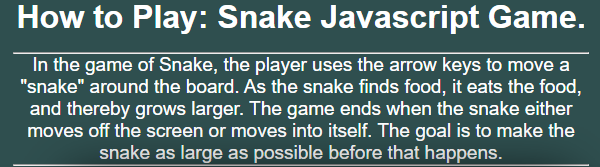
<h2>Restart Popup:</h2>

An option that allows the user to restart the game without refreshing. 
The restart will reset the snake and score and choose a random location for the food.

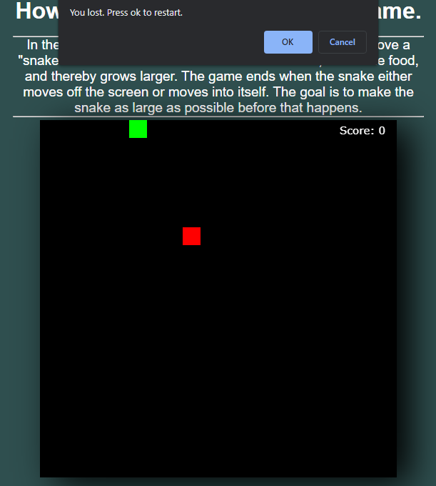
<h2>Board Including Snake & Food:</h2>

Board colored black so it's easy to see the Snake & Food, 
Food being Red and the Snake Green.

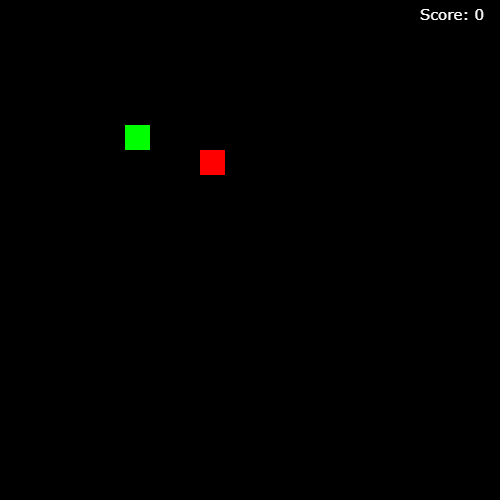
<h2>Score counter:</h2>

A score counter that will count every food piece you eat.

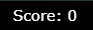
<!------------------Comment------------------>
<h2>Color Scheme:</h2>
<!--Comment-->
 Snake = Lime

 Food = Red

 Board = Black

 
Background = Dark Slate of Gray

<!------------------Comment------------------>
<h1>Deployment:</h1>
<h2>Using Github Pages</h2><li>Navigate to the GitHub <a href="#" target="_blank">Repository</a>:</li>
<li>Click the 'Settings' Tab.</li>
<li>Scroll Down to the Git Hub Pages Heading.</li>
<li>Select 'Master Branch' as the source.</li>
<li>Click the Save button.</li>
<li>Click on the link to go to the live deployed page.</li></ul>

<h2>Run Locally</h2><li>Navigate to the GitHub <a href="#" target="_blank">Repository</a>:</li>
<li>Click the Code drop down menu.</li>
<li>Either Download the ZIP file, unpackage locally and open with IDE (This route ends here) OR Copy Git URL from the HTTPS dialogue box.</li>
<li>Open your developement editor of choice and open a terminal window in a directory of your choice.</li>
<li>Use the 'git clone' command in terminal followed by the copied git URL.
A clone of the project will be created locally on your machine.</li></ul>

<!------------------Comment------------------>

<h1>User Experience:</h1>

Users should be greeted by instructions on how to play the game and the game itself, The text with instructions on how to play the game are white and stand out from the background explaining both controls and the objective of the game.

<!------------------Comment------------------>
<h2>Additional Explanations:</h2>
<ol>
<li>Comments inside the Javascript and ReadME.File color code for when a text or code ends making it easier to navigate the code making it simpler for people with autism & dyslexia to navigate and keep track of where they are. (It's why some are made longer than normal comments)</li>
<li>I made test.js to copy my code and store there for safe keeping as I found myself addicted tearing things apart and mixing other codes together, It was use as a place I could always retreat to safety.</li>
<li>I went with setInterval instade of setTimeout because it's faster and it makes the game more smooth, on the down side it also makes the snake slightly faster but that's alright as the more you progress the infinitely harder the game will become.</li>
</ol>
<!------------------Comment------------------>
<h1>Testing:</h1>
<ul>
<h3>Code Validators</h3>
<li><a href="https://validator.w3.org/nu/#textarea" target="_blank">HTML</a> Validator Results:</li>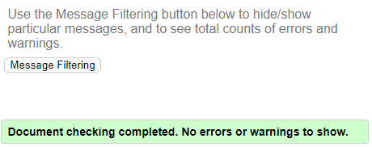
<li><a href="https://jigsaw.w3.org/css-validator/#validate_by_input" target="_blank">CSS</a> Validator Results:</li>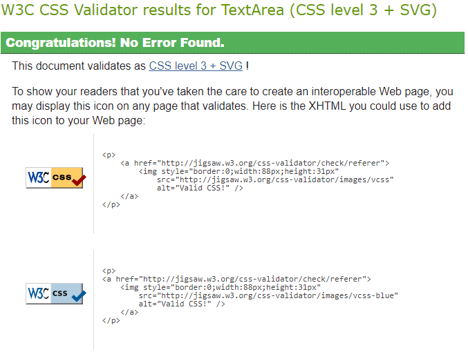
<li><a href="https://jshint.com/" target="_blank">JavaScript</a> Validator Results:</li>
<li><a href="https://webaim.org/resources/contrastchecker/" target="_blank">Contrast Checker</a> Validator Results:</li>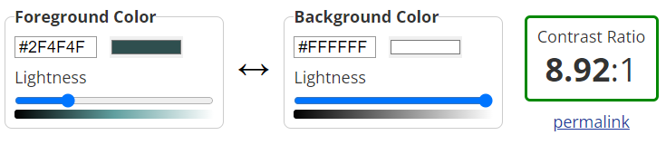
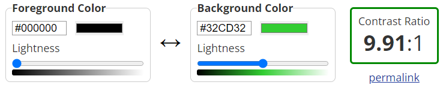
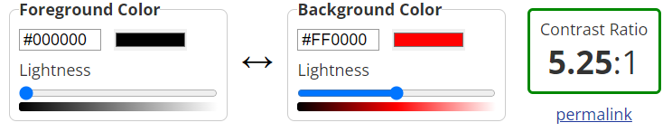
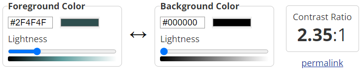

Due to Contrast4 Failing I added a white border

<li>Lighthouse Validator Results:</li>
<h4>Desktop:</h4>
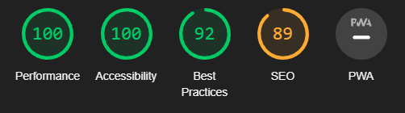

<h4>Moblie:</h4>
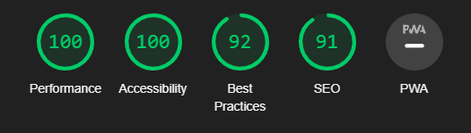

</ul><!------------------Comment------------------>
<h1>Feedback From Friends & Family</h1>
<h2>Feedback:</h2>
<ol>
<li><h3>Þröstur</h3><q>The only thing i can think of and i am not sure you control this or not, but the browser screen is just barely big enough for each time you press up or down, the screen goes up and down with it</q></li>
<!--Comment-->
<li><h3>Ash</h3><q>Game suddenly ends when a set length is reached</q></li>
<!--Comment-->
<li><h3>Victor</h3><q>Seeing my score would be nice.</q></li>
<!--Comment-->
<li><h3>Brian</h3><q>There is input lag and at one point the arrow keys caused the game to move/scroll during play</q></li>
<!--Comment-->
<li><h3>Rútur</h3><q>Screen doesn't seem locked so arrow keys move everything up and down. Also it seems grid doesn't work</q></li>
<!--Comment-->
</ol>
<!------------------Comment------------------>
<h1>Technologies:</h1>

<h3>GitPod:</h3>
<a href="https://www.gitpod.io/" target="_blank">GitPod</a>

Was used to write up the code for my project and using the GitPod terminal to commit everything to GitHub.
<h4>Why GitPod: 
Gitpod continuously builds your git branches like a CI server so that you can start coding right away, no more waiting for dependencies to download and builds to finish.

<!------------------Comment------------------>

<h3>GitHub:</h3>
<a href="https://github.com/" target="_blank">GitHub</a>

Was used to store all the code for this project after being pushed from GitPod.
<h4>Why GitHub: Well It's used for storing, tracking, and collaborating on software projects. It makes it easy for developers to share code files and collaborate with fellow developers on open-source projects. GitHub also serves as a social networking site where developers can openly network, collaborate, and pitch their work</h4>

<!------------------Comment------------------>

<h3>Google Chrome Developer Tools:</h3>

Chrome Developer Tools is a comprehensive toolkit for developers, built directly into the Chrome browser. These tools let you edit web pages in real time, diagnose problems more quickly, and build better websites faster.
 <h3>Developer Tools:</h3>
 Was used for trouble shooting and trying new visual changes without it affect the current code already created.
<ol><li>Elements was used to solve problems related to HTML & CSS.</li>
<li>Console was used to solve problems related to Javascript.</li></ol>

<!------------------Comment------------------>

<h3>Lighthouse:</h3>
<a href="https://chrome.google.com/webstore/detail/lighthouse/blipmdconlkpinefehnmjammfjpmpbjk/related?hl=en" target="_blank">Lighthouse Extension</a>

Was used to analyze the following aspects of a URL: Performance, Progressive Web App, Accessibility, Best Practices and SEO.

A high Lighthouse score also means that you have a well performing website. The speed that a page loads at is extremely important as users do not want to sit around waiting for your webpage to load.

<h4>How to access Lighthouse without Extension:</h4>
<ol><li>On Chrome and you are on Windows you can press F12 on your keyboard and it will open the developer tool. From there you can access Lighthouse</li>
<li>You can also right click on pages and click "Inspect" and you'll have the same pathway to Lighthouse through developer tools.</li></ol>

<!------------------Comment------------------>

<h3>HTML:</h3>
<a href="https://en.wikipedia.org/wiki/HTML" target="_blank">HTML</a>

Was used to construct the core of the website.

<h4>Why HTML :</h4>HTML code ensures the proper formatting of text and images for Internet browsers. Without HTML, a browser would not know how to display text as elements or load images or other elements.

<!------------------Comment------------------>

<h3>CSS:</h3>
<a href="https://en.wikipedia.org/wiki/CSS" target="_blank">CSS</a>

Was used to style the website after the core was made and 
makes the front-end of a website shine and it creates a great user experience

<h4>Why CSS :</h4>CSS makes the front-end of a website shine and it creates a great user experience. Without CSS, websites would be less pleasing to the eye and likely much harder to navigate. In addition to layout and format, CSS is responsible for font color and more.

<!------------------Comment------------------>

<h3>JavaScript:</h3>
<a href="https://en.wikipedia.org/wiki/JavaScript" target="_blank">JavaScript</a>

Makes responsive design easier.

<h4>Why JavaScript :</h4>JavaScript has become integral to the Internet experience as developers build increased interaction and complexity into their applications. Search engines, ecommerce, content management systems, responsive design, social media and phone apps would not be possible without it.

<!------------------Comment------------------>
<h1>Special Thanks & Acknowledgements</h1>
<table><tr>
<th>Mentor
<h3>Ronan McClelland</h3></th>
</tr><tr>
<th>Community Executive
<h3>Lane Sawyer<h3></th></tr>
<tr><th>Testers 
<h3>Þröstur</h3>

<h3>Ash</h3>

<h3>Brian</h3>

<h3>Victor</h3>

<h3>Rútur</h3>
</th></tr></table>

<h1>Credits</h1>
<a href ="https://gyazo.com/
" target="_blank">Gyazo</a> Images for the ReadME 
<a href ="https://www.pngegg.com/
" target="_blank">Pngegg</a> Icons for the ReadME 
<!------------------------Comment------------------------>
<a href ="https://codeinstitute.net/global/
" target="_blank">Code Institude</a> 
<!------------------------Comment------------------------>
<a href ="https://www.sololearn.com/
" target="_blank">Sololearn</a> 
<!------------------------Comment------------------------>
<a href ="https://www.w3schools.com/
" target="_blank">W3schools</a> 
<!------------------------Comment------------------------>
<a href ="https://stackoverflow.com/
" target="_blank">Stackoverflow</a> 

<!------------------------Comment------------------------>
<a href ="https://github.com/Kamau-ke/How-to-buid-snake-game-with-javaScript/tree/main/snake%20game
" target="_blank">Ian Kamau GitHub</a>

<!------------------------Comment------------------------>
<a href ="https://github.com/WebDevSimplified/Javascript-Snake-Game
" target="_blank">Web Dev Simplified GitHub</a> 
<!------------------------Comment------------------------>
<a href ="https://www.youtube.com/watch?v=QTcIXok9wNY" target="_blank">
Web Dev Simplified Youtube Channel
</a>

<!------------------------Comment------------------------>
<a href ="https://github.com/ImKennyYip/snake" target="_blank">Kenny Yip GitHub</a> 
<!------------------------Comment------------------------>
<a href ="https://www.youtube.com/watch?v=baBq5GAL0_U" target="_blank">Kenny Yip Coding Youtube Channel</a>

<!------------------------Comment------------------------>